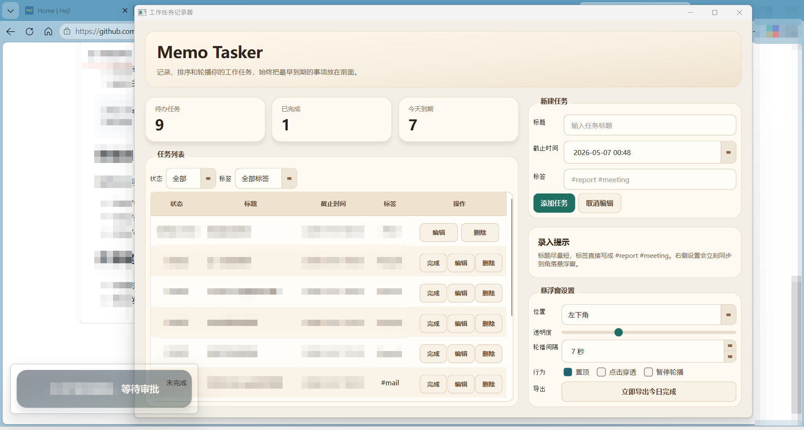

# Memo Tasker



一个面向 Windows 的本地任务记录工具，包含两个界面：

- 主界面：录入、编辑、完成和筛选任务
- 悬浮窗：半透明置顶轮播未完成任务标题

## 已实现功能

- 本地 SQLite 存储任务
- 任务字段：标题、截止时间、标签
- 按截止时间升序显示未完成任务
- 悬浮窗支持拖动、置顶、点击穿透、透明度调节、暂停轮播
- 完成任务后记录完成时间
- 每天下午 17:55 自动导出今日已完成任务 Markdown
- 如果 17:55 之后才启动程序，会自动补导出当天文件

## 运行方式

1. 创建并激活 Python 3.10+ 虚拟环境
2. 安装依赖
3. 运行主程序

```powershell
pip install -r requirements.txt
python main.py
```

## 数据目录

程序会在项目目录下创建和使用这些文件：

- data/tasks.db
- data/settings.json
- data/exports/YYYY-MM-DD-done.md

## 开源建议

- 不要提交 data 目录里的运行数据
- 首次发布前可以补充截图、License 和打包说明